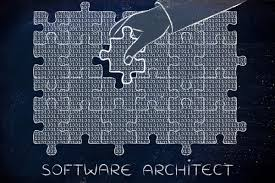

# Software-Architecture
Software architecture involves creating structures to understand and build software systems.

Software architecture refers to the collection of structures that are necessary to analyze and reason about a software system. It involves the discipline of creating and modeling these structures using tools such as architecture description languages, architecture viewpoints, and architecture frameworks. The software architecture of a system represents the design decisions related to the overall structure and behavior of the system. This helps in comprehending how the system can achieve essential qualities such as modifiability, availability, and security.

-    [Actor Model Architecture](#actor-model-architecture) 
     
-   [Vertical Slice Architecture](#vertical-slice-architecture)
    
-   [Event Driven Architecture](#event-driven-architecture)

 -   [Service Oriented Architecture](#service-oriented-architecture)
    
-   [Microservices Architecture](#microservices-architecture)
    
-   [Modular Monolith Architecture](#modular-monolith-architecture)
    
-   [Architecture Decision Records Architecture](#architecture-decision-records-architecture) 

## Actor model Architecture
The Actor Model is a mathematical model of concurrent computation that considers an actor as the fundamental building block of concurrent systems. In this model, every component is an actor, and actors communicate by sending and receiving asynchronous messages. Each actor can create new actors, define the behavior for the next message it receives, and maintain its private state. The Actor Model provides location transparency, allowing actors to be located anywhere. It has been influential in commercial practice, with companies like Twitter and Microsoft using it for scalability and asynchronous agents library development, respectively.

## Vertical Slice Architecture
Vertical Slice Architecture is an architectural pattern that prioritizes organizing code based on features or capabilities, rather than technical concerns. It involves grouping all aspects related to a specific feature, from front-end to back-end, into a vertical slice, instead of organizing code into separate layers. This approach aims to minimize coupling between slices and maximize coupling within a slice, resulting in more maintainable and adaptable code.

According to Jimmy Bogard, who has been building architectures around vertical slice for several years, this approach involves building the architecture around distinct requests, encapsulating and grouping all concerns from front-end to back-end. Instead of coupling across a layer, the coupling is done vertically along a slice, minimizing the need for shared layer abstractions like repositories, services, and controllers.

## Event Driven Architecture

Event-Driven Architecture (EDA) is a software architecture paradigm that focuses on the production and detection of events. An event can be defined as a significant change in state, such as a purchase or a change in data. 

In an event-driven architecture, events are used to trigger and communicate between decoupled services. They are delivered in near real-time, allowing consumers to respond immediately to events as they occur. 

This architecture is common in modern applications built with microservices. It is characterized by three key components: event producers, event routers, and event consumers. Event producers generate a stream of events, which are then filtered and pushed to consumers. 

The architecture is extremely loosely coupled and well-distributed, providing a scalable infrastructure for information exchange and distributed workflows. It is commonly found in applications that use microservices or have decoupled components, and it is ideal for improving agility and moving quickly. 

Event-driven architectures are also suitable for real-time processing with minimum time lag, complex event processing, and handling high volumes and velocities of data, such as in IoT solutions.

## Service Oriented Architecture

Service-Oriented Architecture (SOA) is an architectural style in software engineering that emphasizes the use of discrete services rather than a monolithic design. The primary focus of SOA is to make software components reusable and interoperable through service interfaces, which enable services to be accessed remotely and acted upon independently. SOA facilitates the integration of distributed, separately maintained, and deployed software components, and it is designed to be independent of vendors, products, and technologies. 

Services in SOA are self-contained and represent repeatable business activities that can be composed of other services. They use protocols to describe how they pass and parse messages using description metadata. The ultimate goal of SOA is to enable users to combine large chunks of functionality to form applications built purely from existing services, and to combine them in an ad hoc manner.

## Microservices Architecture[
Microservices architecture is an approach to software development that structures an application as a collection of small, loosely coupled services, which communicate with each other using lightweight protocols. Each service is developed, deployed, and maintained independently with its own clear interfaces and distinct responsibilities. This allows teams to work independently, leading to faster development and deployment, as well as the ability to use pre-built services more easily. 

Microservices architecture is often used to build flexible, scalable, and cloud-native applications. It enables continuous delivery and continuous integration and is characterized by its business-driven development approach, fine-grained interfaces, and the ability to evolve services with limited restrictions from users.

## Modular Monolith Architecture

Modular monolith architecture is a way of organizing a software application into a set of modules, each with specific functionality that can be independently developed and tested. The entire application is deployed as a single unit. Unlike traditional monoliths, modular monoliths segment code into individual feature modules, with each module exposing a programming interface definition to other modules to establish bounded context. This approach enables high reusability of logic while keeping data consistent and communication patterns simple. Managing a modular monolith is easier than managing tens or hundreds of microservices, which keeps underlying infrastructural complexity and operational costs low. Modular monoliths are particularly useful during the early stages of software development and can be a better alternative to microservices in some cases, especially when the operational complexity of microservices is not justified.

## Architecture Decision Records Architecture

During the software development process, it's common to make important architectural decisions that affect the project or product. To capture these decisions, Architecture Decision Records (ADRs) are used. 

An Architectural Decision (AD) is a justified software design choice that addresses either a functional or non-functional requirement that has a significant impact on the architecture of the software. ADRs are used to provide a history of decisions made by the team and to help inform future decision choices and deployments. 

ADRs should be created for every architecturally significant decision that affects the software project or product, including structure, non-functional requirements, dependencies, interfaces, and construction techniques. Typically, ADRs describe the architectural decision, its context, and its consequences. They are often stored in a Markdown file close to the code base relevant to that decision. 

A collection of ADRs creates a decision log, which provides detailed implementation and design information, as well as the project context. This information can be used by the team to make informed decisions in the future and to understand the reasoning behind past decisions.

